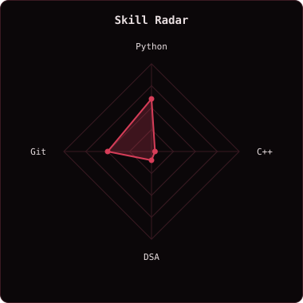
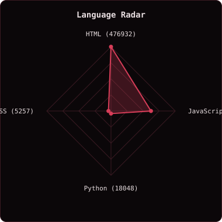
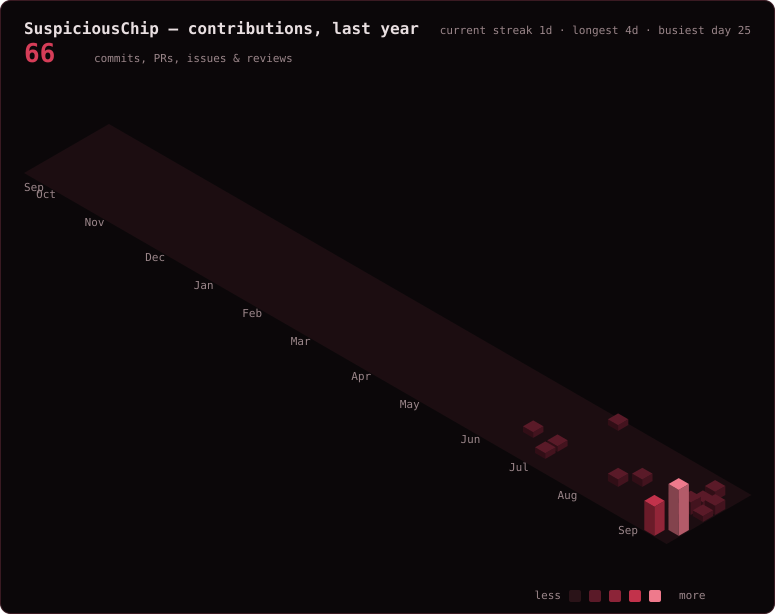
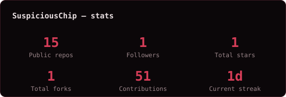

  

  
  
   
  

## `~/` whoami

Hi, I'm **Aryan Dixit(aka SUSPICIOUS)**. One or two lines about what you study / build / care about.

- Learning OpenSource
- Newton School Of Technology
- “Any man who must say 'I am the King' is no true King.”

## `~/` toolbox

## `~/` skill radar

One I rated myself (edit `config.json`). The other counts real language bytes across my public repos and redraws itself on a schedule.

<table>
  <tr>
    <td></td>
    <td></td>
  </tr>
</table>

## `~/` contribution calendar

## `~/` the numbers

everything above regenerates itself on a schedule — nothing here is hand-updated

